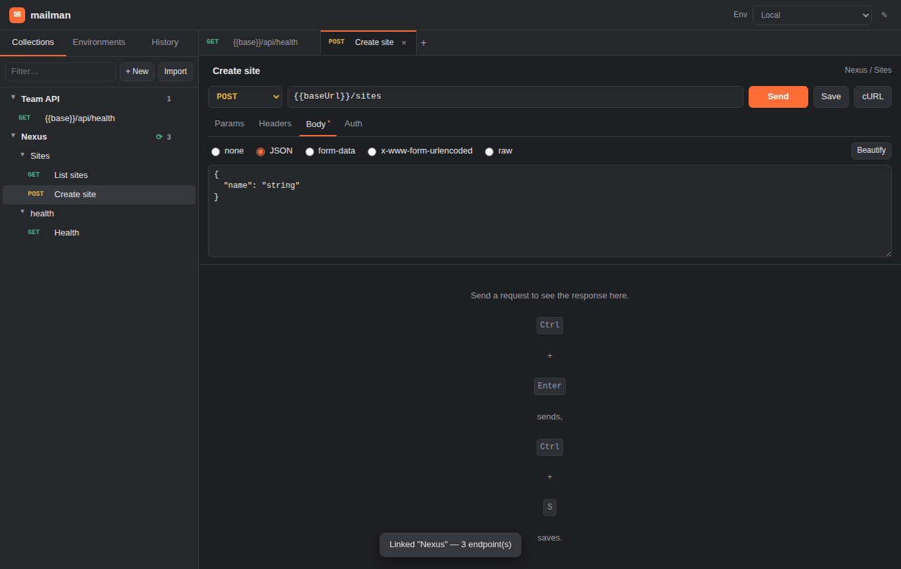

# mailman

A self-hosted API client for your team. Postman without the bill.

- **Desktop app** (Windows, macOS, Linux) built with Electron.
- **Team server** (one Docker container) so everyone shares the same collections and environments, live.
- Works **offline** with a local workspace; switch to the team server whenever you want.
- **Imports your Postman collections and environments** (v2.0 / v2.1 exports) and exports them back.
- **Auto-synced collections from OpenAPI / Swagger**: link a service's spec URL once and every new endpoint shows up for the whole team, with example bodies, query params and auth pre-filled.
- Variables (`{{baseUrl}}`), environments, folders, history, auth helpers (Bearer / Basic / API key), JSON, form-data, urlencoded and raw bodies, "copy as cURL".
- Zero paid services, zero accounts. A SQLite file on your server holds everything.



## How it fits together

```
 ┌────────────────────┐        ┌────────────────────┐
 │  mailman desktop   │        │  mailman desktop   │   ...each teammate
 │  (Electron)        │        │  (Electron)        │
 │  ┌──────────────┐  │        │  ┌──────────────┐  │
 │  │ local server │  │        │  │ local server │  │   embedded, for the
 │  │ + SQLite     │  │        │  │ + SQLite     │  │   "Local workspace"
 │  └──────────────┘  │        │  └──────────────┘  │
 └─────────┬──────────┘        └─────────┬──────────┘
           │  "Team server" mode proxies /api to →
           ▼                              ▼
       ┌──────────────────────────────────────────┐
       │  mailman team server (Docker)            │
       │  Express + SQLite, optional password     │
       │  also serves the web UI in a browser     │
       └──────────────────────────────────────────┘
```

The desktop app always talks to its own embedded server. In **Team server** mode that embedded server forwards API calls to the shared server and adds the team password, so credentials never live in the renderer and there is no CORS to configure.

The team server also serves the same UI in a browser, so people who don't want to install anything can just open `http://your-server:4000`.

## Quick start

### 1. Run the team server

```bash
git clone <this repo> && cd mailman
cp .env.example .env            # set MAILMAN_PASSWORD if the server is reachable beyond your LAN/VPN
docker compose up -d --build
```

The API and web UI are now on port 4000. Data lives in the `mailman-data` volume.

Without Docker:

```bash
npm install
npm run build                    # builds the web UI
MAILMAN_PASSWORD=changeme npm start
```

### 2. Run the desktop app

Development (hot reload for the UI):

```bash
npm install
npm run desktop:dev
```

Build installers for your platform (output in `desktop/release/`):

```bash
npm run desktop:dist             # dmg/zip on macOS, nsis/portable on Windows, AppImage/deb on Linux
```

Then in the app click **Local workspace** in the title bar → **Team server** → enter `http://your-server:4000` and the team password → **Test connection** → **Save & reload**.

### 3. Bring your Postman data over

In Postman: right-click a collection → **Export** (v2.1). Same for environments (gear icon → Export).
In mailman: **Collections → Import**, drop the file. Variables like `{{baseUrl}}` keep working.

### 4. Keep a collection in sync with your API (e.g. Nexus)

If a service publishes an OpenAPI 3.x or Swagger 2.0 document, mailman can own a collection for it:

1. **Collections → Import → Link an OpenAPI spec**, paste the spec URL (JSON or YAML), e.g. `https://nexus.internal/openapi.json`.
2. mailman builds one request per operation, grouped into folders by tag, with query parameters, headers, an example JSON body generated from the schema, and the auth scheme the spec declares (`{{token}}`, `{{apiKey}}`, …).
3. The team server re-reads the spec every 5 minutes (`MAILMAN_SYNC_INTERVAL_MS`). Add an endpoint to the service, and it appears in everyone's mailman. Removed endpoints disappear; renamed ones are updated in place. The collection menu also has **Sync now**.

Request URLs are `{{baseUrl}}/path`, so pick the server with an environment (`baseUrl = https://nexus-staging.internal`, `token = …`). Path parameters become variables too: `/sites/{siteId}` → `{{baseUrl}}/sites/{{siteId}}`.

Linked collections are managed by the sync, so edits inside them are overwritten on the next sync. To customise a request, duplicate it into another collection, or **Unlink from spec** to freeze the collection as normal editable requests.

Most frameworks can emit the spec for you: FastAPI and NestJS do it out of the box (`/openapi.json`, `@nestjs/swagger`), Express has `swagger-jsdoc` / `express-openapi`, Spring has `springdoc`, .NET has Swashbuckle, Rails has `rswag`.

## Configuration (server)

| Variable | Default | Meaning |
| --- | --- | --- |
| `PORT` | `4000` | HTTP port |
| `HOST` | `0.0.0.0` | Bind address |
| `MAILMAN_PASSWORD` | *(empty)* | Shared team password (HTTP Basic auth). Empty = no auth. |
| `MAILMAN_DB` | `./data/mailman.db` | SQLite file path |
| `MAILMAN_TIMEOUT_MS` | `30000` | Per-request timeout when sending |
| `MAILMAN_SYNC_INTERVAL_MS` | `300000` | How often linked OpenAPI collections are re-synced |
| `MAILMAN_STATIC` | `./client/dist` | Directory of the built web UI |

The desktop app stores its settings and local database under the OS user-data directory (e.g. `~/Library/Application Support/mailman` on macOS).

## Security notes

- Requests are executed **by the server** (like Postman's cloud agent). Anyone who can reach the team server can make it call any URL it can reach, including internal services. Keep the server on your LAN/VPN or behind a reverse proxy with TLS, and set `MAILMAN_PASSWORD`.
- Environment values marked *secret* are masked in the editor but stored in plain text in SQLite, like Postman's local vault. Treat the database file accordingly.
- History keeps the last 500 requests (response bodies truncated) and is shared with the team.

## Project layout

```
server/   Express API + SQLite (node:sqlite, no native builds). Also serves the web UI.
client/   Vue 3 + Vite + TypeScript UI (used by both the browser and the desktop app).
desktop/  Electron shell: embeds the server for the local workspace, proxies to the team server.
```

Scripts at the root:

| Command | What it does |
| --- | --- |
| `npm run dev` | Server (port 4000) + Vite dev server (port 5173) for browser development |
| `npm run desktop:dev` | Same, plus the Electron window pointed at the dev server |
| `npm run build` | Build the web UI into `client/dist` |
| `npm start` | Run the server (serves the built UI) |
| `npm test` | Server unit + API tests |
| `npm run typecheck` | Type-check the client |
| `npm run desktop:pack` | Unpacked desktop build in `desktop/release/` (quick check) |
| `npm run desktop:dist` | Installers for the current platform |

Requires Node.js 22.13 or newer (for the built-in SQLite module).

## API

Everything the UI does goes through `/api`, so you can script it too:

| Method | Path | Notes |
| --- | --- | --- |
| GET | `/api/collections` | Collections with their folders and requests |
| POST/PATCH/DELETE | `/api/collections[/:id]` | |
| GET | `/api/collections/:id/export` | Postman v2.1 JSON |
| POST | `/api/collections/from-openapi` | `{ url, name? }` → creates a collection linked to a spec URL |
| POST | `/api/collections/:id/sync` | Re-read the linked spec now |
| PATCH | `/api/collections/:id` | `{ sourceUrl: null }` unlinks a synced collection |
| POST/PATCH/DELETE | `/api/folders[/:id]` | |
| GET/POST/PATCH/DELETE | `/api/requests[/:id]` | |
| GET/POST/PATCH/DELETE | `/api/environments[/:id]` | |
| GET | `/api/environments/:id/export` | Postman environment JSON |
| POST | `/api/import` | Body: a Postman collection / environment export, or an OpenAPI document (one-off import) |
| POST | `/api/send` | `{ request, environmentId }` → executes and returns the response |
| POST | `/api/curl` | Same input, returns a cURL command |
| GET/DELETE | `/api/history[/:id]` | |

## Roadmap ideas

Pre-request / test scripts, per-user accounts, request-level docs pages, WebSocket/GraphQL helpers, collection runner. PRs welcome.

## License

MIT
